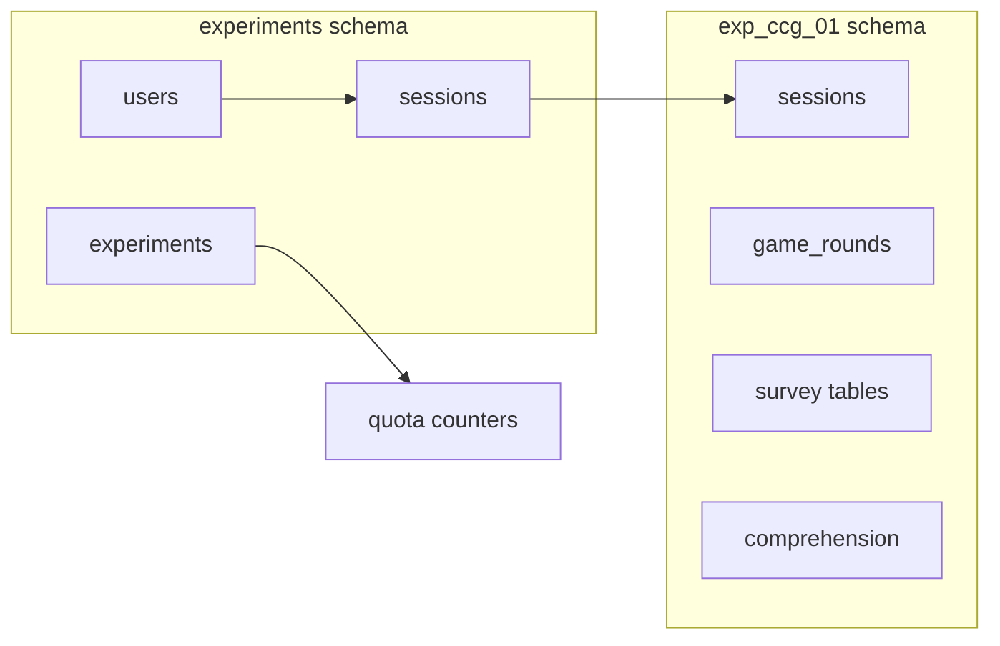

# Project context

## 1. Purpose and scope

- Host **online social science / experimental economics** studies as self-contained SvelteKit routes
  under `src/routes/exp/`.
- **ccg-01** — production-shaped study: Color Coordination Game (CCG), comprehension checks,
  recorded play, post-game survey.
- Site shell: `src/routes/(site)/` (home links to `/exp/ccg-01`).

## 2. Stack

| Layer         | Choice                                                       | Repo                                          |
| ------------- | ------------------------------------------------------------ | --------------------------------------------- |
| App           | SvelteKit 2, Svelte 5, Vite                                  | `package.json`, `svelte.config.js`            |
| Deploy target | **Deno Deploy** (stateless serverless)                       | Requirement; `@sveltejs/adapter-auto` in repo |
| DB / auth     | Supabase (Postgres + Auth)                                   | `src/hooks.server.ts`, migrations             |
| Tooling       | Deno fmt/lint in places; `deno task dev` / `deno task build` | `deno.json`, `package.json`                   |

**Supabase migration trees:** `supabase-preview/` and `supabase-prod/` (environments). Do not
document or copy values from `.env`.

**Env categories (no catalog):** Supabase URL + anon key (public), service role (server),
`PRIVATE_CCG_01_SECRET_KEY` (HMAC cookie), Prolific API key when verifying `platform=prolific`.

## 3. Code organization

```text
src/
  routes/exp/<study-id>/     # $exp → src/routes/exp
    +page.*                  # Gate (ccg-01)
    (pages)/                 # Gated step routes
    _state/                  # HMAC cookie + ExperimentState + page ACL helpers
    _database/               # *DBM.ts: localStorage + Supabase submit
    _syncHandler/            # Client sync queue (ccg-01 uses v3)
    _components/             # Study-specific UI
    api/                     # Server routes (e.g. comprehension)
  lib/common/                # Question types, feedback, debugger, shared CSS helpers
  lib/exp/                   # Cross-study: CCG engine, platform-api, navigation
```

- **TS:** logic in `.ts`; Svelte for UI wiring.
- **CSS:** scoped in `.svelte`; study `src/routes/exp/ccg-01/experiment.css`; site
  `src/routes/root.css`.
- **Data:** POJOs for payloads; **classes** where Svelte 5 reactivity helps (`SyncHandler`,
  `Debugger.svelte.ts`).
- **Alias:** `$exp` → `src/routes/exp` (`svelte.config.js`).

## 4. Stateless server vs client persistence

| Concern                                            | Where                                         | Notes                                                                                        |
| -------------------------------------------------- | --------------------------------------------- | -------------------------------------------------------------------------------------------- |
| Progression / permissions                          | **httpOnly signed cookie** `exp-ccg-01-state` | `src/routes/exp/ccg-01/_state/Cookie.ts`, `ExperimentState.ts`                               |
| In-progress responses, rounds, timings, sync queue | **localStorage**                              | `*DBM.ts`, `SyncHandler` scope `exp_ccg_01`                                                  |
| Rehydration                                        | Per-page `load`/`save` in DBM modules         | Cookie + server loads define what user may access; localStorage is not authoritative for ACL |

**Sync pipeline:** component `sync` → `SyncHandler.enqueue` → `startQueue` → `SyncHandlerActions` →
`*DBM.submit`. See `src/routes/exp/ccg-01/_syncHandler/v3/Design.md`.

**Invariants**

- No in-memory server session store.
- Never trust localStorage for `pages.*.permitted` or roles; only signed cookie + server
  verification.
- Queue flush requires `SyncHandler.initDb(supabase, sessionId)` (`ready` = `db` + `authUserId`
  set).

## 5. Authentication and authorization

### A. Study flow gate — HMAC state cookie

- **Cookie:** `exp-ccg-01-state`, httpOnly, signed payload `{ user, session, pages }` + `signature`
  (`PRIVATE_CCG_01_SECRET_KEY`, HMAC-SHA256).
- **Layout load:** `src/routes/exp/ccg-01/+layout.server.ts` — `verifyStateCookie`; invalid/missing
  → `newExpState(url)`, set cookie, redirect to `/exp/ccg-01` if off gate.
- **Activity expiry:** `ACTIVITY_EXPIRATION_LIMIT` = 6h (`Cookie.ts`); participants → clear
  `withinQuota`, redirect gate for quota recheck. DB:
  `experiments.experiments.session_expiration_interval` default 6h
  (`supabase-preview/.../20260713010_experiments_table_experiments.sql`).
- **Page ACL:** `src/routes/exp/ccg-01/(pages)/+layout.server.ts` — redirect if
  `expState.pages[pageName].permitted` is falsy; furthest permitted: `maxPage()` in
  `_state/Pages.ts`.
- **Advance flow:** server actions call `setNextPageCookie()` (`_state/Server.ts`) — uses
  `validateStateCookieOrRedirect` for mutations.

### B. Data writes — Supabase Auth

- `hooks.server.ts`: `locals.supabase`, validated session helper.
- Root layout passes browser `supabase`; `ccg-01/+layout.svelte` calls `syncHandler.initDb` when
  `session.sessionId` exists.
- Privileged server ops: service role `src/routes/exp/ccg-01/_database/ServiceRole.ts` (registration
  RPC, quota).

## 6. Platform participants

- **Query params:** `study_id`, `platform`, `pid`, `p_session_id`, `role`
  (`src/lib/exp/platform-api/PlatformClaims.ts`).
- **Verification:** `PlatformVerification.ts` — `test-pass`, `test-fail`, `prolific`.
- **Quota:** RPC `experiments.get_fresh_quota_data` with `p_experiment_id: "exp_ccg_01"`
  (`_database/Quota.ts`).
- **Roles (non-exhaustive):** `participant`, `over-quota`, `over-quota-buffer`, `downgraded`,
  `failed-platform-verification`, `failed-quota-fetch`.
- **Claim vs cookie:** `reconcileClaimWithExpState` in `+layout.server.ts` — mismatch → reset state,
  redirect gate with query string.

## 7. Database model (high level)



- **Shared:** `experiments.users`, `experiments.sessions`, `experiments.experiments` (quota,
  counters, expiration).
- **Study:** schema `exp_ccg_01`; experiment id `exp_ccg_01` (`_database/Registration.ts`).
- **Registration:** RPC `experiments.register_for_experiment`.
- **Background:** pg_cron in migrations (e.g.
  `supabase-preview/supabase/migrations/20260713200_exp_ccg_01_setup_and_cron_jobs.sql`) —
  expiration/finalization jobs exist; do not assume in-app timers.

## 8. ccg-01 study flow

`PAGE_ORDER` (`_state/Pages.ts`): `""` (gate) → `quota` (gate page state, not a separate route) →
`consent` → `registration` → `game_description_1` → `game_description_2` → `game_play` → `survey` →
`end`.

| Step                      | Path / module                                                                                                 | Behavior                                                                                                                                                                                                                |
| ------------------------- | ------------------------------------------------------------------------------------------------------------- | ----------------------------------------------------------------------------------------------------------------------------------------------------------------------------------------------------------------------- |
| End                       | `(pages)/end/+page.server.ts`, `_state/clearClientSession.ts`                                                 | When `experiments.sessions.status` is `completed`, `finalizeClientSession` deletes the state cookie; client clears `exp_ccg_01:*` localStorage, resets `SyncHandler`, signs out Supabase auth, then redirect timer runs |
| Gate                      | `+page.svelte`, `+page.server.ts`                                                                             | Quota + platform verification; non-`participant` or `withinQuota === true` skips gate UI                                                                                                                                |
| Game engine               | `src/lib/exp/games/ccg/v3/`                                                                                   | Study config: `_components/ColorCoordinationGame/GameConfig.ts` — **48** rounds `participant`, **12** otherwise; coordination + prediction                                                                              |
| Comprehension (validated) | `api/comprehension/+server.ts`                                                                                | Server submit via `ComprehensionQuestionServer.ts` (contrast: MCQ sync via `ComprehensionQuestionDBM` + queue)                                                                                                          |
| Observability             | `src/lib/server/logger.server.ts` (`pino`); client `debug` namespaces; dev `DebuggerTree` on `+layout.svelte` |                                                                                                                                                                                                                         |

## 9. Patterns for changes

- **New gated step:** add to `PAGE_ORDER`; Svelte route under `(pages)/`; server action
  `setNextPageCookie(complete, grant, revoke)`.
- **New persisted instrument:** `*DBM.ts` with `load` / `save` / `sync` / `submit`; register in
  `_syncHandler/v3/SyncHandlerActions.ts`.
- **Reusable UI:** prefer `src/lib/common/`; keep study-specific rules in `routes/exp/ccg-01`.
- **Secrets:** server-only env; never expose HMAC secret or service role to client.

## 10. Omitted intentionally

- Full migration list, every survey `qid`, avatar inventory.
- Complete env var list (only categories above).
- Local dev how-to beyond: `deno task dev` against appropriate Supabase project.

## Quick answers

| Question                               | Answer                                                                                                              |
| -------------------------------------- | ------------------------------------------------------------------------------------------------------------------- |
| Where is progression stored?           | Permitted/completed pages + session fields in **signed cookie**; response bodies in **localStorage** until synced.  |
| How does survey sync?                  | `SurveyMultipleChoiceQuestionDBM` → `sync` enqueues → `submitSurveyMultipleChoiceQuestion` in `SyncHandlerActions`. |
| Cookie activity expired (participant)? | `withinQuota` cleared; redirect `/exp/ccg-01`; gate action rechecks quota/platform.                                 |
